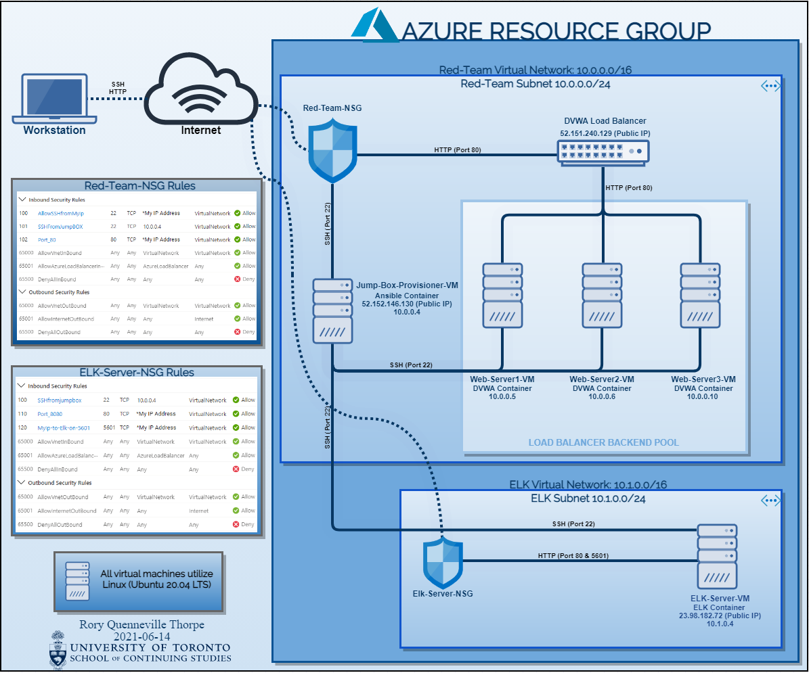
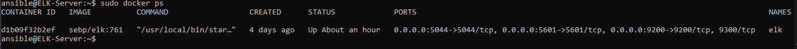
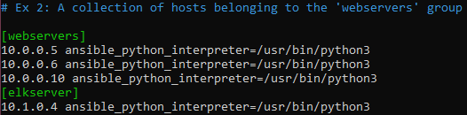

## Automated ELK Stack Deployment

The files in this repository were used to configure the network depicted below.  

These files have been tested and used to generate a live ELK deployment on Azure. They can be used to either recreate the entire deployment pictured above. Alternatively, select portions of the playbook file may be used to install only certain pieces of it, such as Filebeat. 

*Please note: Both Docker and Ansible will need to be previously installed through the use of the Jump-Box-Provisioner

* [pentest.yml](./Ansible/pentest.yml) - To install the DVWA
* [ELK-Playbook.yml](./Ansible/ELK-Playbook.yml) - To install ELK
* [Filebeat-Config.yml](./Ansible/Filebeat-Config.yml) - To configure Filebeat
* [Filebeat-playbook.yml](./Ansible/Filebeat-Playbook.yml) - To install Filebeat
* [Metricbeat-Config.yml](./Ansible/Metricbeat-Config.yml) - To configure Metricbeat
* [Metricbeat-playbook.yml](./Playbooks/Metricbeat-Playbook.yml) - To install Metricbeat

This document contains the following details:
- Description of the Topology
- Access Policies
- ELK Configuration
  - Beats in Use
  - Machines Being Monitored
- How to Use the Ansible Build

### Description of the Topology

The main purpose of this network is to expose a load-balanced and monitored instance of DVWA, the D*mn Vulnerable Web Application.

Load balancing ensures that the application will have high availability, in addition to restricting access to the network. With our load balancer, response times are minimized and maximum throughput is achieved. Efficiency and availability are two objectives that can be met here, mitigating the risks associated with denial of service attacks and being able to compensate should a server become compromised. Naturally, these risks are reduced but not completely. 

On the other hand, using our Jump-Box-Provisioner as the only virtual machine that can directly access other machines on the network ensures
access to the network is kept minimized. No other machines, beyond the webservers hosting the DVWA, can foreseeably be accessed by another outside machine.

Integrating an ELK server allows users to easily monitor the vulnerable VMs for changes to the logs and system traffic. Filebeat will collect the logs and forward them to the server and, similarly, Metricbeat will record the metrics and statistics and forward them to the same destination. Examples we can expect to see are system logs that pertain to the syslogs of the webservers and metrics monitoring the overall health of the containers (CPU usage, Memory usage, current status etc).

The configuration details of each machine may be found below:
|          Name         |      Function     | IP Address |     Operating System     |
|-----------------------|-------------------|------------|--------------------------|
| Jump-Box-Provisioner  | Gateway - Ansible | 10.0.0.4   | Linux (Ubuntu 20.04 LTS) |
| Web-Server1           | Web Server - DVWA | 10.0.0.5   | Linux (Ubuntu 20.04 LTS) |
| Web-Server2           | Web Server - DVWA | 10.0.0.6   | Linux (Ubuntu 20.04 LTS) |
| Web-Server3           | Web Server - DVWA | 10.0.0.10  | Linux (Ubuntu 20.04 LTS) |
| Elk-Server            | ELK Stack         | 10.1.0.4   | Linux (Ubuntu 20.04 LTS) |

### Access Policies

The machines on the internal network are not exposed to the public Internet. 

Only the Jump-Box-Provisioner machine can accept connections from the Internet. Access to this machine is only allowed from the following IP addresses:
- My Personal IP Address

Machines within the network can only be accessed by SSH.
- The only machine that can directly access the ELK-Server VM is the Jump-Box-Provisioner VM with its internal IP address of 10.0.0.4. My workstation with my personal IP address, has been enabled to access Kibana using HTTP. 

A summary of the access policies in place can be found in the table below:

|          Name         |  Publicly Accessible  |                      Allowed IP Addresses                       |
|-----------------------|-----------------------|-----------------------------------------------------------------|
| Jump-Box-Provisioner  | No                    | My Personal IP Address                                          |
| Web-Server1           | Yes via load balancer | 52.151.240.129 (Load Balancer), 10.0.0.4 (Jump-Box-Provisioner) |
| Web-Server2           | Yes via load balancer | 52.151.240.129 (Load Balancer), 10.0.0.4 (Jump-Box-Provisioner) |
| Web-Server3           | Yes via load balancer | 52.151.240.129 (Load Balancer), 10.0.0.4 (Jump-Box-Provisioner) |
| Elk-Server            | No                    | My Personal IP Address, 10.0.0.4 (Jump-Box-Provisioner)         |

### Elk Configuration

Ansible was used to automate configuration of the ELK machine. No configuration was performed manually, which is advantageous because 
ansible allows for the continuous integration and continuous deployment regarding any current and future machines.

The ELK playbook implements the following tasks:
- Installs the Docker engine (we will need this for running containers)
- Installs Python and the Docker Python Module
- Increases the virtual memory of the VM
- Downloads and launches the Docker Elk container, while also:
  - setting the restart policy to always
  - establishing the published ports
- Enables the service docker on boot

The following screenshot displays the result of running `docker ps` after successfully configuring the ELK instance.

### Target Machines & Beats
This ELK server is configured to monitor the following machines:

|         Name          | IP Address |   
|-----------------------|------------|
| Web-Server1           | 10.0.0.5   |
| Web-Server2           | 10.0.0.6   | 
| Web-Server3           | 10.0.0.10  | 

We have installed the following Beats on these machines:
- Filebeat
- Metricbeat

### Using the Playbook
In order to use the playbook, you will need to have an Ansible control node already configured. Assuming you have such a control node provisioned: 

SSH into the Ansible control node and follow the steps below:
- Copy the playbook (.yml) file to /etc/ansible 
- Update the hosts file (same directory) to include the virtual machines by their internal IP and their respective server grouping
  - This can be done by running the following command:
    nano /etc/ansible/hosts

    

    *This will aid in specifying which machine to install the ELK server on versus the machines that will require Filebeat, Metricbeat and the DVWA. Meanwhile, Adding 'ansible_python_interpreter=/user/bin/python3' will allow Ansible to detect the use of Python 3!
  
- Run the playbooks and update the corresponding configuration file (where relevant), in the order listed above. 
  - The playbooks can be run with the following command:
  ansible-playbook /etc/ansible/<filename.yml>
- Following successful installation of playbooks, navigate to http://[your.ELK-VM.External.IP]:5601/app/kibana to check that Kibana is accessible  
- Navigate to the Kibana Home page, as we still need to import our data from our webservers
  - Import the log data by clicking 'Add log data' and 'System logs'
   - scroll down and click 'Check data' and afterwards click 'System logs dashboard'
  - Import the metric data by clicking 'Add metric data' and 'Docker Metrics'
   - scroll down and click 'Check data' and then 'Docker metrics dashboard'

_As a **Bonus**, provide the specific commands the user will need to run to download the playbook, update the files, etc._
